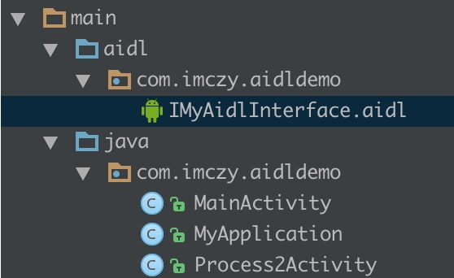
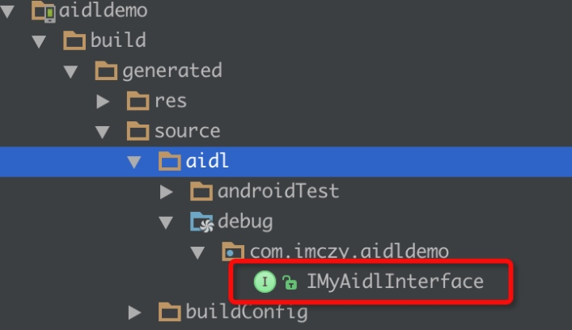

# AIDL 使用学习
最近遇到了一些多进程的问题,现在来总结学习下,

默认情况下, app 只占用一个进程.
但是偶尔会遇到一些特殊的需求,需要吧一些任务放到另外一个进程去执行, 这样就需要用到多进程了

##1. 声明多进程
声明多进程很简单, 只需要在mainfest文件中, 指定相应activity service等 是在哪个进程 如下所示:
```xml
<activity  
    android:name=".Process2Activity"  
    android:process=":process2"/>  
```
如果没有写 android:process 则默认是在主进程
上面的那个  Process2Activity 是在 process2进程中得.
那么 当在启动 Process2Activity 时
如果该进程不存在则会启动一个新的进程, 同时还会启动这个进程对应的Application
(可以初略的理解为 启动另一个app )
如下log


当然Service也是如上声明,就不在赘述

###注意
1. 当启动其他进程的组件时, 会创建一个新进程(如果该进程不存在的话),那么会增大app所暂用的内存, 应当酌情考虑是否使用多进程
2. 主进程与其他进程之间的 对象都是相互独立的, 如果在主进程有ClassA的单例, 那么在进程Process2 中相应的ClassA的单例与主进程不是同一个,因为他们使用的不是同一块内存
3. 当进程起来后,就不会自动的死掉, 需要适当考虑,是否收到吧另外一个进程杀掉,防止占用内存

##2. 多进程间通信AIDL
上面有提到说, 主进程与Process2经常使用的不是同一块内存, 对象是相互独立的,
那么问题来了,
如果主进程 向 调用Process2进程中某个功能 方法时,  就不能简单的通过执行对象的方法来实现了.
因为在正常情况下 主进程是拿不到 Process2 的对象的.

但是又不得不这样做时,  那么就需要用到AIDL 了跨进程通信了
AIDL (Android Interface Definition Language,即Android接口定义语言)
先来学习如何使用AIDL吧 文档
[http://developer.android.com/guide/components/aidl.html](http://developer.android.com/guide/components/aidl.html)

###创建AIDL file  


###定义AIDL 接口
这里 测试 在Process2 进程中通过AIDL 获取主进程的pid
```java
interface IMyAidlInterface {  
    /** 
     * Demonstrates some basic types that you can use as parameters 
     * and return values in AIDL. 
     */  
    void basicTypes(int anInt, long aLong, boolean aBoolean, float aFloat,  
            double aDouble, String aString);  
  
    int getPid();  
}  
```
使用AndroidStudi 它不会自动生成 相应的IMyAidlInterface.java文件,
它会在编译的时候生成, 如下图:


可以把它拷贝出来放到 AIDL文件相同目录下去, 也可以不去管它

###实现接口, 以及服务端
需要定义一个service如下
```java
public class MainService extends Service {  
    public static final String TAG = "MainService";  
  
    @Override  
    public void onCreate() {  
        super.onCreate();  
        LogUtil.d(TAG, "onCreate");  
    }  
  
    @Nullable  
    @Override  
    public IBinder onBind(Intent intent) {  
        LogUtil.d(TAG, "onBind");  
        return mBinder;  
    }  
  
    private IMyAidlInterface.Stub mBinder = new IMyAidlInterface.Stub() {  
        @Override  
        public void basicTypes(int anInt, long aLong, boolean aBoolean, float aFloat, double aDouble, String aString) throws RemoteException {  
        }  
  
        @Override  
        public int getPid() throws RemoteException {  
            // 返回当前 service 的pic  
            LogUtil.d(TAG, "getPid");  
            return android.os.Process.myPid();  
        }  
    };  
  
}  
```
然后在mainfest中申明该service
至此  服务端即主进程的工作以及完毕了.

###Process2 连接主进程 即 客户端连接服务端
在 Process2Activity 中定义一个ServiceConnection 如下:

```java
IMyAidlInterface mIMyAidlInterface;  
    private ServiceConnection mConnection = new ServiceConnection() {  
        // Called when the connection with the service is established  
        public void onServiceConnected(ComponentName className, IBinder service) {  
            // Following the example above for an AIDL interface,  
            // this gets an instance of the IRemoteInterface, which we can use to call on the service  
            LogUtil.d(TAG, "onServiceConnected");  
            mIMyAidlInterface = IMyAidlInterface.Stub.asInterface(service);  
            try {  
                mMsgTxt.setText("main pic = " + mIMyAidlInterface.getPid());  
            } catch (Exception e) {  
                e.printStackTrace();  
            }  
        }  
  
        // Called when the connection with the service disconnects unexpectedly  
        public void onServiceDisconnected(ComponentName className) {  
            LogUtil.e(TAG, "Service has unexpectedly disconnected");  
            mIMyAidlInterface = null;  
        }  
    };  
```

然后在使用该connection连接主进程中创建的 service即可

```
Intent intent = new Intent(Process2Activity.this, MainService.class);  
bindService(intent, mConnection, Context.BIND_AUTO_CREATE);  
```
连接成功机会执行 
`public void onServiceConnected(ComponentName className, IBinder service)` 方法
随后执行  `mIMyAidlInterface = IMyAidlInterface.Stub.asInterface(service);`
即可得相应的我们定义的AIDL接口的代理对象, 然后可以执行相应的方法
`mIMyAidlInterface.getPid()`
至此 就完成了 多进程间AIDL 的通信

**注意**
需要在适当的适合 unbindService 


